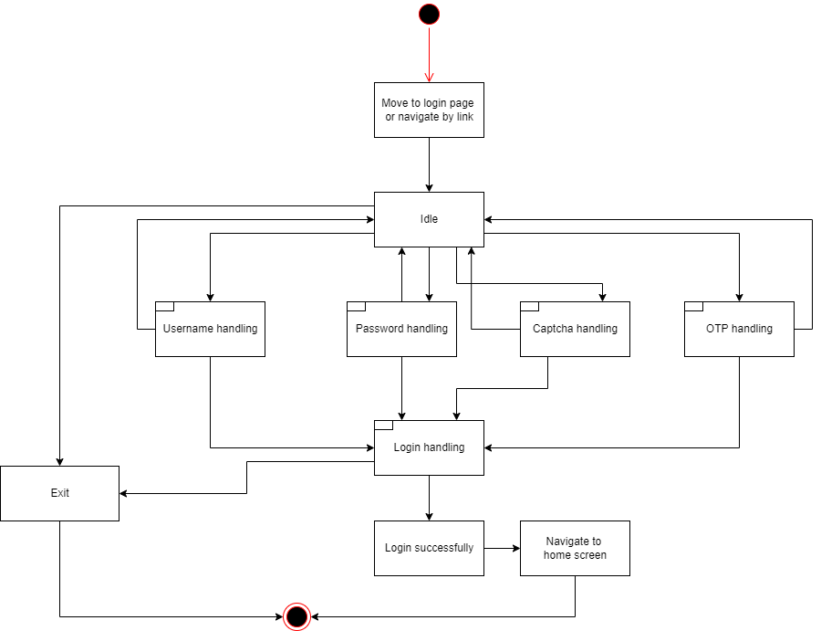
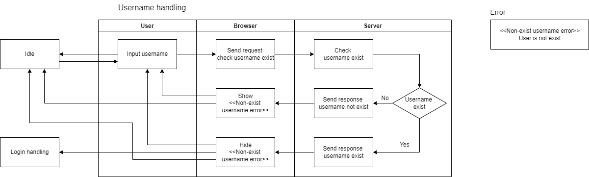
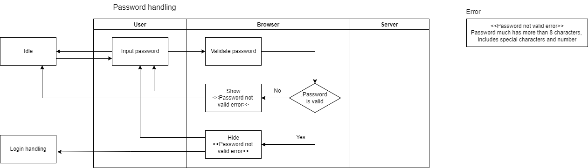
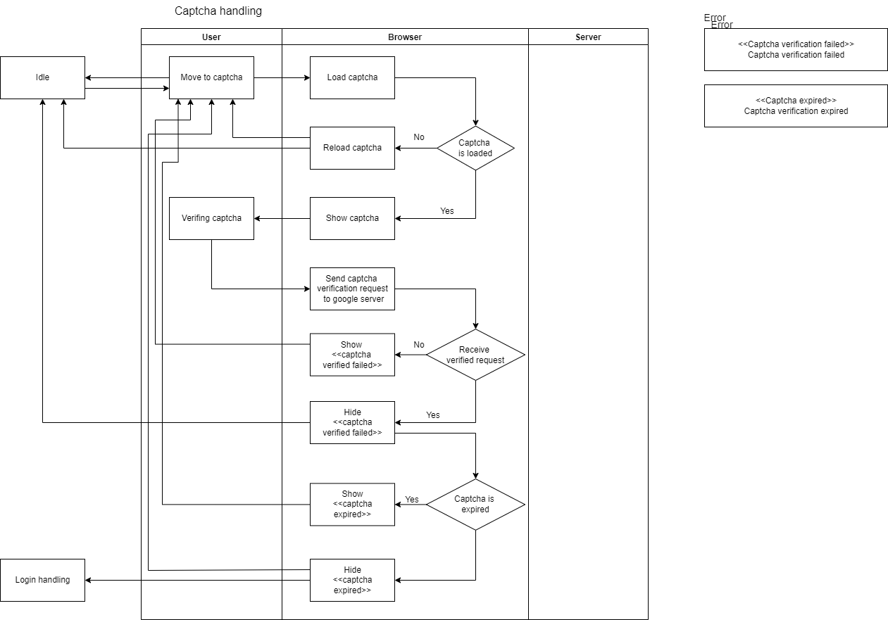
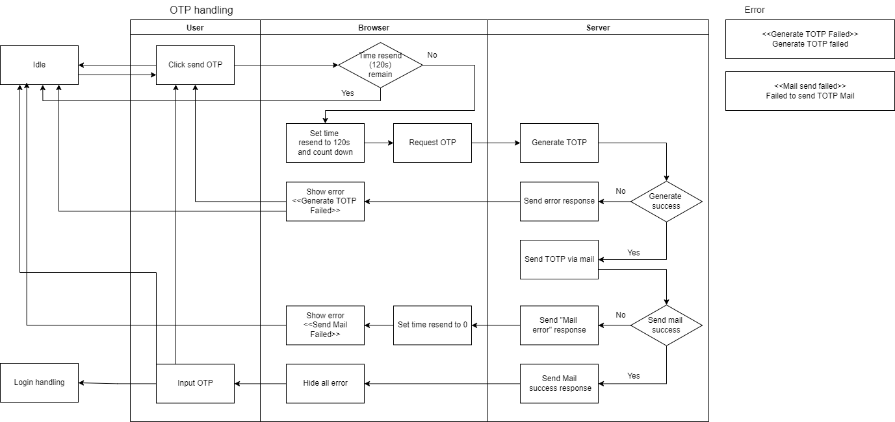
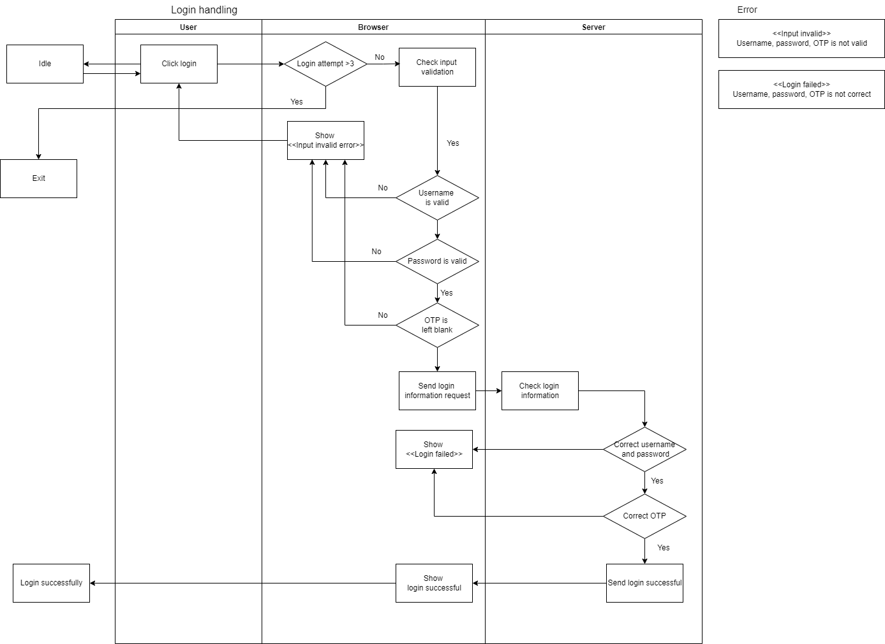

# Authentication

## Technique

- TOTP

## Design:

- Activity diagram
  - Login:
    - Main:
      
    - Username:
      
    - Password:
      
    - Captcha:
      
    - OTP:
      
    - Login:
      
